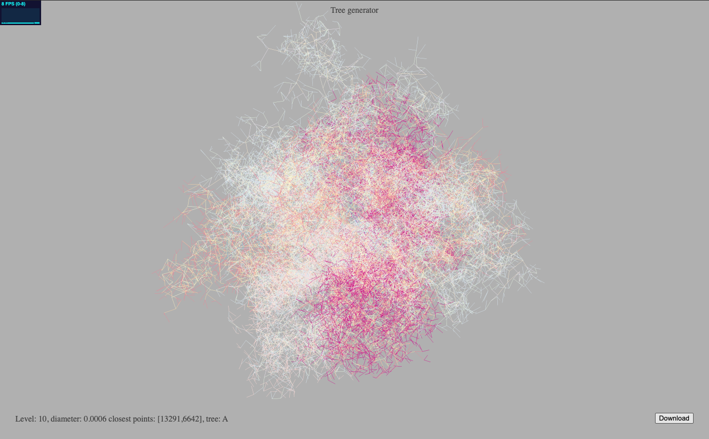

# Network of tubular structures

### Motivation

A way to understand a dataset is by mapping some of its features to a model. If the model has a simple description those features of the original dataset can be explained away using that model. Whatever left in the data will be the source of new discoveries.

## Description

This module creates and visualizes tree structures with a given diameter at each vertex. The tree is created by adding new nodes successively in a random way - similar to angiogenesis of blood vessels. Each time a _vessel_ is added the module checks if the new segments overlaps with any other segment of the tree. The maximum allowed overlap area is specified by the sum of the radii of both vessel-like structures adding in a diffusion constant of 100&micron;m.

The process is repeated with a second tree starting out at the same location as the root nodes of the first tree. The two trees are not connected - but the module guarantees that the second tree does not overlap (other than the root nodes at 0,0,0 and +-L,0,0 and 0,+-L,0 and 0,0,+-L) with the first tree.



The above visualization is generated using two different colormaps for the two trees ('A' in darker red and 'B' in lighter pastell colors). Both colormaps use the diameter (log diameter) as the mapped color value per vertex. 

## Features

The "Download" button will create two spreadsheets that contain the nodes and vertices of both trees. The exported value "length" corresponds to the distance of the next node from the root of the tree, the "level" value corresponds to the number of branching points from the root node.

If the number of nodes parameter in the code is set to a smaller number an adjacency matrix is displayed in the viewer. A click on the display will switch between different ways of sorting the rows and columns in the matrix. The initial matrix display illustrates the order used in the creation of the tree (breath first). Is illustrates nicely the features of a purse tree with a fixed number of decendence at each level.  


### How to start

The module is written in JavaScript. Download (git clone) the repository and start a webserver in the directory. Here an example with the build-in web-server from php. Start the web-server from inside the repository directory.

```
git clone https://github.com/HaukeBartsch/vessel_network.git
cd vessel_network
php -S localhost:8000
```

Under Windows you might also be able to use the web-server build into python (3.9):
```
python -m http.server 
```

Navigate with a browser to the web-address (localhost:8000). You need to wait for the tree generation to finish. Adjust the number of vertices in the code (top section of module in index.html).

### Remarks

The first tree 'A' is created first. The second tree 'B' will be grown afterwards. It would be better to grow both trees at the same time. Right now the first tree can crowd out the space and the second tree cannot find a corner to grow from.

The nodes are added in each tree based on a breath first search manner. The number of possible segments starting from any segments end point is 2.

The diameter value starts at something like 0.2 and is reduced each depth level by a factor of 0.9. The length of the start segments is 1 and also reduced by the factor of 0.9 (with some noise). More realistic is a reduction by 0.7071 (area preserving at 2-split).

There is a momentum term for the direction of the segment growth (and a lot of noise).

We should preferably grow segments in directions that have a low density of segments in them (octree). This would ensure that the small vessels fill the space.

The diameter of vessels should correspond to the volume of blood in the sub-tree that is downstream. Vessels that reach a large area without segments could grow in diameter.


